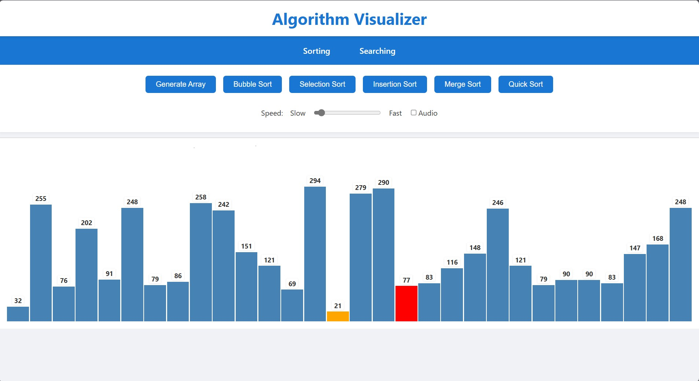
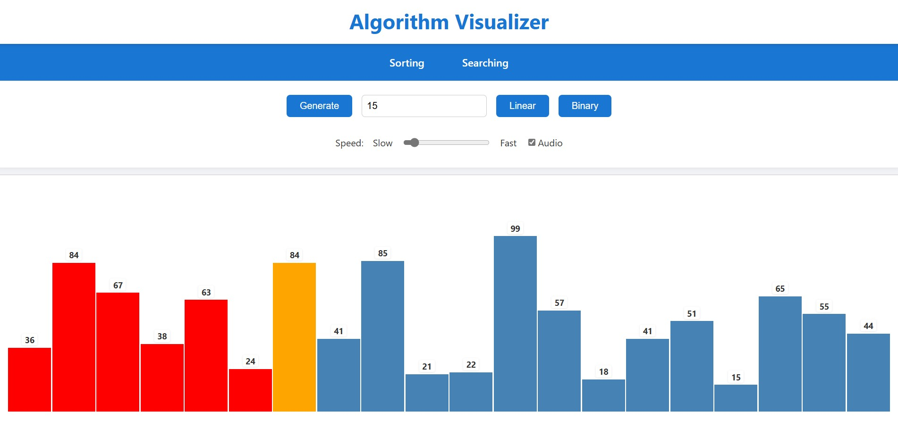

# 🧠 Algorithm Visualizer

**Algorithm Visualizer** is an interactive web application designed to visually demonstrate the inner workings of fundamental algorithms. Whether you are a student, educator, or enthusiast, this tool provides a dynamic and intuitive way to explore algorithms through animation and interactivity.

---

## ✨ Key Features

- 🎞️ **Step-by-step Visualizations**  
  Watch algorithms unfold one operation at a time, enhancing conceptual clarity.

- 🔢 **Algorithms Covered**
  - **Sorting Algorithms**: Bubble Sort, Selection Sort, Insertion Sort, Merge Sort, Quick Sort
  - **Searching Algorithms**: Linear Search, Binary Search

- ⚙️ **Customizable Parameters**
  - Modify animation speed
  - Shuffle or regenerate input

- 🖱️ **Interactive Controls**
  - Play / Pause / Reset
  - Visual highlight of comparisons, swaps, and decisions

- 📱 **Responsive Interface**  
  Optimized for desktops, tablets, and mobile devices.

---

## 💡 Technology Stack

| Framework   | Styling | Logic Management |
|-------------|---------|------------------|
| React.js    | CSS     | React Hooks      |

---

## 📸 Visual Preview

## Sorting Page

## Searching Page

